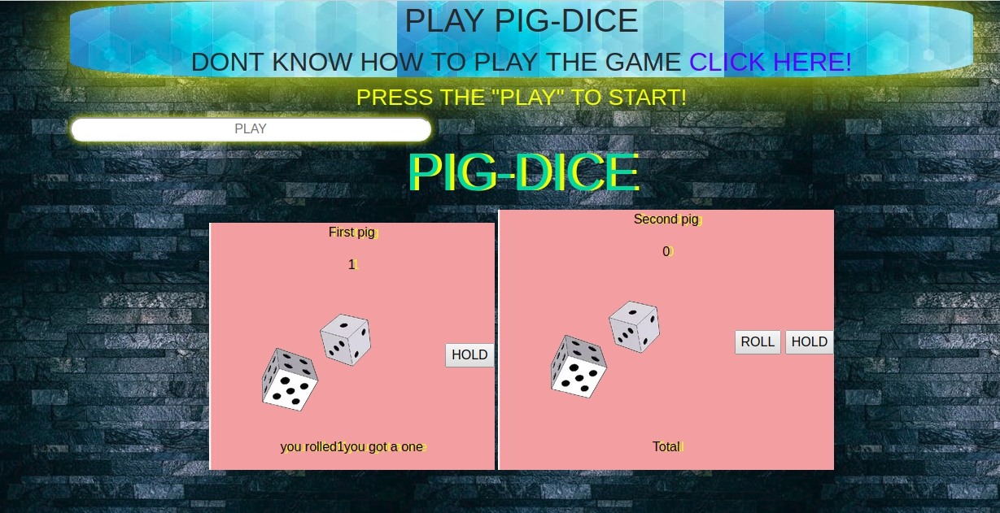

# {PIG DICE}
#### {this application is a game }, {12/5/2019}
#### By **{salehudeen}**
## Description
{This is a game that playes with dices and people have to get to a totol of 100 in their dice. this is an online link to the game  https://salehudeen.github.io/pig-dice/ }
## BDD
Program Add player rolls a 1, they score nothing and it becomes the next player's turn.	User input: "1"	Output: "End Turn"
Program Add player rolls any other number, it is added to their turn total and the player's turn continues.	User Input: "2 through 6"	Output: "+2 through 6 to score"
Program Add player chooses to "hold", their turn total is added to their score, and it becomes the next player's turn.	Input: "Hold"	Output: round score is added next players turn.
Program Add The first player to score 100 or more points wins.	Input: "100"	Output: "You win!"

## screenshot of the application

## Setup/Installation Requirements
* get access to my online git repository 
* copy the clone or download link 
* get to the teminal 
* and git clone (link)
{if notice any queries you can contact me im always available at example@gmail.com}
## Known Bugs
{this is bugges as per this point but if noticed please contact the email above . }
## Technologies Used
{the game used the following 
* HTML
* CSS
* BOOTSTRAP
* JAVASCRIPT.}
## Support and contact details
{again if you as a user acquire any issues please contact me or if you wish to collaborate with me lets talk.}
### License
*{this application was licensed by  MIT.}*
Copyright (c) {2019} **{salehudeen}**
 
